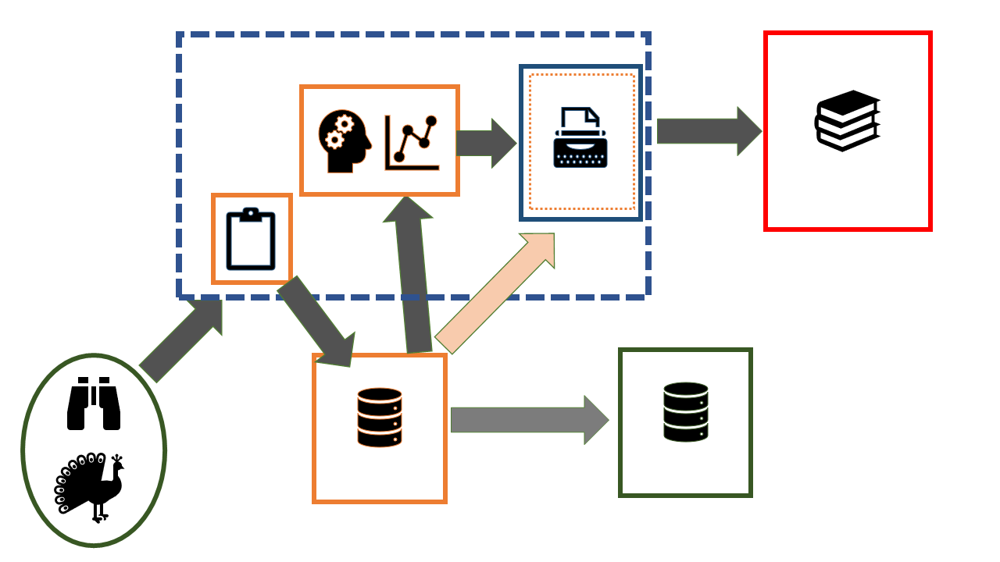

<!-- Limit image width and height -->
<style type='text/css'>
img {
    max-height: 560px;
    max-width: 964px;
}
</style>

<!-- Center image on slide -->
<script src="http://ajax.aspnetcdn.com/ajax/jQuery/jquery-1.7.min.js"></script>
<script type='text/javascript'>
$(function() {
    $("p:has(img)").addClass('centered');
});
</script>

<style type='text/css'>
.eightyfive {
   font-size: 85%;
   }
</style>


   
## Schematic of current workflow
 


--- .class #id 

## Data sharing 


--- .class #id 

## Code sharing 

 


--- .class #id 

## We are sharing data - but not code

Culina et al. (2020) PLoS Biol 18(7): e3000763. (n=346)


 

--- .class #id 

## Although data sharing may not be complete 
"56% were incomplete" (n= 100)

```{r, message=FALSE, warning=FALSE, echo=FALSE}
library(tidyverse)
library(see)
library(XML)
Dryad<-read.csv("C:/Users/matthew.grainger/Documents/Projects_in_development/LNC2020_presentation/data/Dryad_data_2012_2013.csv", h=TRUE)
levels(Dryad$journal)<-c("Biology Letters","Evolution", "Evo Applications", "J of Evo Biology", "Nature", "Science","Am Naturalist")    
Dryad %>% 
  dplyr::select(complScore, reuseScore, journal, year) %>% 
  ggplot(aes(x=complScore, y=journal, fill=journal))+
  ggridges::geom_density_ridges()+
  labs(x="Completeness score \n (1= Poor, 2= large omission, 3= small omission, 4= Good, 5 = Exemplary)", y="")+
  xlim(0,5)+
  ggthemes::theme_base()+
  theme(legend.position = "none")+
  ggtitle("Roche et al. 2015, PLoS Biol 13(11): e1002295")+
  theme(plot.title = element_text(size = 12))+
  theme(axis.title.x = element_text(size= 9))+
   theme(axis.title.y = element_text(size= 9))
  

```


--- .class #id

## And reuse is prevented
"64% were archived in a way that prevented reuse" (n= 100)

```{r, message=FALSE, warning=FALSE, echo=FALSE}

Dryad %>% 
  dplyr::select(complScore, reuseScore, journal, year) %>% 
  ggplot(aes(x=reuseScore, y=journal, fill=journal))+
  ggridges::geom_density_ridges()+
  labs(x="Reuse score \n (1= Very poor, 2= poor, 3= average, 4= Good, 5 = Exemplary)", y="")+
  xlim(0,5)+
  ggthemes::theme_base()+
  theme(legend.position = "none")+
  ggtitle("Roche et al. 2015, PLoS Biol 13(11): e1002295")+
  theme(plot.title = element_text(size = 12))+
  theme(axis.title.x = element_text(size= 9))+
   theme(axis.title.y = element_text(size= 9))
  

```


--- .class #id

##  Barriers to data sharing
Wiley survey 2014 (n=2250)

<style type="text/css"> body {background:none transparent; } </style>

```{r, echo=FALSE, message=FALSE, warning=FALSE}
# Create data
data <- data.frame(group=paste("Group_", sample(letters, 70, replace=T), sample(letters, 70, replace=T), sample(letters, 70, replace=T), sep="" ), value=sample(seq(1,70),70)) 

# Add a column with the text you want to display for each bubble:


data<-data.frame("group"=c("confidentiality", "not required (funder etc.)", "scoop", "misuse", "ethics", "improper credit", "where to share", "no time", "how to share", "not my job", "data not interesting", "lack of funds", "other"),
                 "value"=c(42,36,26,26,23,22,21,20,16,12,12,11,7))
data$text <- paste("reason: ",data$group, "\n", "value:", data$value, "\n")

data$subgroup<-c("Society","Society","Society","Society","Society","LivingNorwayR","LivingNorwayR","LivingNorwayR","LivingNorwayR", "Researcher", "Researcher", "Society", "other")

# Circlepacker package
library(circlepackeR)         
# devtools::install_github("jeromefroe/circlepackeR") # If needed

# create a nested data frame giving the info of a nested dataset:

# Change the format. This use the data.tree library. This library needs a column that looks like root/group/subgroup/..., so I build it
library(data.tree)
data$pathString <- paste("Realm", data$subgroup,data$group, sep = "/")
survey_results <- as.Node(data)

# Make the plot
#circlepackeR(population, size = "value")

# You can custom the minimum and maximum value of the color range.
p <- circlepackeR(survey_results, size = "value")#, color_min = "hsl(56,80%,80%)", color_max = "hsl(341,30%,40%)")
#library(htmlwidgets)
#library(widgetframe)

#saveWidget(p, file="wiley.html",selfcontained = TRUE)

#frameWidget(p)

```


```{r, echo=FALSE, warning=FALSE, message=FALSE,cache=FALSE,results='asis'}
require(rCharts)
cat('<iframe src="C:/Users/matthew.grainger/Documents/Projects_in_development/LNC2020_presentation/slides/assets/widgets/wiley.html" width=100% height=100% allowtransparency="true"> </iframe>')

```

--- .class #id

## Schematic of future workflow



--- .class #id 

## Introducing {LivingNorwayR}

https://github.com/LivingNorway/LivingNorwayR

- An R package designed to facilitate the future workflow
- Main features 
  - Import & Export Darwin Core Archive
  - Mapping data (with reduced pain) to DWC terms
  - Metadata extraction/writing functions
  - Plotting functions
  - Modelling functions 

--- .class #id

## Toolchain walkthrough


--- .class #id

## Dataset

We will import this data and use it to demonstrate some of the workflow

Nilsen E B, Pedersen H C, Brøseth H, Moa P F, Vang R (2019). Rock ptarmigan (Lagopus muta) radio telemetry in Lierne, Norway. Version 1.2. Norwegian Institute for Nature Research. Occurrence dataset https://doi.org/10.15468/o4zcd3 accessed via GBIF.org on 2020-10-10. https://www.gbif.org/dataset/b848f1f3-3955-4725-8ad8-e711e4a9e0ac#

Paper: https://doi.org/10.3389/fevo.2020.00034

Code: https://osf.io/qwb6u

--- class. #id

## Set up the "Living Norway data package" structure

```{r, eval=FALSE}
library(LivingNorwayR)
build_folder_structure(project_name = "Tetraonidae_Lagopus")
map_folders(project_name = "Tetraonidae_Lagopus")
#map_files(project_name = "Tetraonidae_Lagopus")

```


```{r, echo=FALSE, warning=FALSE,cache=FALSE,results='asis'}
cat('<iframe src="./assets/widgets/plot.html" width=100% height=100% allowtransparency="true"> </iframe>')
```

--- .class #id

## Import the data and map to DwCObject 

```{r, echo=FALSE, warning=FALSE, message=FALSE}

library(R6)
library(magrittr)
library(leaflet)
#Testing and playing with R6 Class

DwCOccurence<-R6::R6Class("DwCOccurence",
                          list(id= NULL,
                               ownerInstitutionCode= NULL,
                               basisOfRecord= NULL,
                               dynamicProperties= NULL,
                               occurrenceID= NULL,
                               sex= NULL,
                               lifeStage= NULL,
                               organismID= NULL,
                               organismName= NULL,
                               eventDate= NULL,
                               eventTime= NULL,
                               country= NULL,
                               countryCode = NULL,
                               locality         = NULL,
                               decimalLatitude= NULL,
                               decimalLongitude= NULL,
                               geodeticDatum= NULL,
                               coordinateUncertaintyInMeters= NULL,
                               taxonID= NULL,
                               scientificName= NULL,
                               kingdom= NULL,
                               phylum= NULL,
                               class= NULL,
                               order= NULL,
                               family= NULL,
                               genus= NULL,
                               initialize = function(id,ownerInstitutionCode,basisOfRecord,
                                                     dynamicProperties,
                                                     occurrenceID,
                                                     sex,
                                                     lifeStage,
                                                     organismID,
                                                     organismName,
                                                     eventDate,
                                                     eventTime,
                                                     country,
                                                     countryCode ,
                                                     locality         ,
                                                     decimalLatitude,
                                                     decimalLongitude,
                                                     geodeticDatum,
                                                     coordinateUncertaintyInMeters,
                                                     taxonID,
                                                     scientificName,
                                                     kingdom,
                                                     phylum,
                                                     class,
                                                     order,
                                                     family,
                                                     genus,...){
                                 self$id<-id
                                 self$ownerInstitutionCode<-ownerInstitutionCode
                                 self$basisOfRecord<-basisOfRecord
                                 self$dynamicProperties<-dynamicProperties
                                 self$occurrenceID<-occurrenceID
                                 self$sex<-sex
                                 self$lifeStage<-lifeStage
                                 self$organismID<-organismID
                                 self$organismName<-organismName
                                 self$eventDate<-eventDate
                                 self$eventTime<-eventTime
                                 self$country<-country
                                 self$countryCode <-countryCode
                                 self$locality         <-  locality
                                 self$decimalLatitude<-decimalLatitude
                                 self$decimalLongitude<-decimalLongitude
                                 self$geodeticDatum<-  geodeticDatum
                                 self$coordinateUncertaintyInMeters<-coordinateUncertaintyInMeters
                                 self$taxonID<-taxonID
                                 self$scientificName<-scientificName
                                 self$kingdom<-kingdom
                                 self$phylum<-phylum
                                 self$class<-class
                                 self$order<-order
                                 self$family<- family
                                 self$genus<-genus
                                 self$object()
                               },
                               object=function(...){
                                 object<-data.frame(id=id,
                                                    ownerInstitutionCode=
                                                      ownerInstitutionCode,
                                                    basisofRecord=self$basisOfRecord,
                                                    dynamicProperties=self$dynamicProperties,
                                                    occurrenceID= self$occurrenceID,
                                                    sex= self$sex,
                                                    lifeStage= self$lifeStage,
                                                    organismID= self$organismID,
                                                    organismName= self$organismName,
                                                    eventDate= self$eventDate,
                                                    eventTime= self$eventTime,
                                                    country= self$country,
                                                    countryCode= self$countryCode,
                                                    locality= self$locality,
                                                    decimalLatitude= self$decimalLatitude,
                                                    decimalLongitude= self$decimalLongitude,
                                                    geodeticDatum= self$geodeticDatum,
                                                    coordinateUncertaintyInMeters= self$coordinateUncertaintyInMeters,
                                                    taxonID= self$taxonID,
                                                    scientificName= self$scientificName,
                                                    kingdom= self$kingdom,
                                                    phylum= self$phylum,
                                                    class= self$class,
                                                    order= self$order,
                                                    family= self$family,
                                                    genus= self$genus
                                 )},
                               get_bounding_box=function(...){
                                 minX=min(self$decimalLongitude)
                                 maxX=max(self$decimalLongitude)
                                 minY=min(self$decimalLatitude)
                                 maxY=max(self$decimalLatitude)
                                 print(c(
                                   "minX"=minX,
                                   "maxX"=maxX,
                                   "minY"=minY,
                                   "maxY"=maxY))
                                 
                               },
                               plotmap=function(...){
                                 df=data.frame(id=id,
                                               occurrenceID= self$occurrenceID,
                                               sex= self$sex,
                                               lifeStage= self$lifeStage,
                                               organismID= self$organismID,
                                               organismName= self$organismName,
                                               eventDate= self$eventDate,
                                               eventTime= self$eventTime,
                                               decimalLatitude= self$decimalLatitude,
                                               decimalLongitude= self$decimalLongitude,
                                               geodeticDatum= self$geodeticDatum,
                                               coordinateUncertaintyInMeters= self$coordinateUncertaintyInMeters)
                                 #coords=c(as.numeric(df$decimalLongitude), as.numeric(df$decimalLatitude))
                                 #print(df)
                                 #my.sf.point <- sf::st_as_sf(x = df, coords = c(decimalLongitude, decimalLatitude),
                                 #                           crs = "+proj=longlat +datum=WGS84")
                                 #print(my.sf.point)
                                 leaflet::leaflet() %>% addTiles() %>% addMarkers(lng=df$decimalLongitude,
                                                                                  lat=df$decimalLatitude, popup = paste0(
                                                                                    "<b>Sex: </b>"
                                                                                    ,df$sex
                                                                                    
                                                                                    ,"<b>  eventDate: </b>"
                                                                                    ,df$eventDate
                                                                                  ))
                                 
                               }))
```

```{r, echo=FALSE}
occurrence <- read.delim("C:/Users/matthew.grainger/Documents/Projects_in_development/LNC2020_presentation/slides/Tetraonidae_Lagopus/data/derived/occurrence.txt")

Rock<-DwCOccurence$new(
  id<-occurrence$id,
  ownerInstitutionCode<-occurrence$ownerInstitutionCode,
  basisOfRecord<-occurrence$basisOfRecord,
  dynamicProperties<-occurrence$dynamicProperties,
  occurrenceID<-occurrence$occurrenceID,
  sex<-occurrence$sex,
  lifeStage<-occurrence$lifeStage,
  organismID<-occurrence$organismID,
  organismName<-occurrence$organismName,
  eventDate<-occurrence$eventDate,
  eventTime<-occurrence$eventTime,
  country<-occurrence$country,
  countryCode<-occurrence$countryCode ,
  locality<-occurrence$locality         ,
  decimalLatitude<-occurrence$decimalLatitude,
  decimalLongitude<-occurrence$decimalLongitude,
  geodeticDatum<-occurrence$geodeticDatum,
  coordinateUncertaintyInMeters<-occurrence$coordinateUncertaintyInMeters,
  taxonID<-occurrence$taxonID,
  scientificName<-occurrence$scientificName,
  kingdom<-occurrence$kingdom,
  phylum<-occurrence$phylum,
  class<-occurrence$class,
  order<-occurrence$order,
  family<-occurrence$family,
  genus<-occurrence$genus)
```

```{r, echo=TRUE, eval=FALSE}
Rock<-DwCOccurence$new(
  id<-occurrence$id,
  ownerInstitutionCode<-occurrence$ownerInstitutionCode,
  basisOfRecord<-occurrence$basisOfRecord,
  dynamicProperties<-occurrence$dynamicProperties,
  occurrenceID<-occurrence$occurrenceID,
  sex<-occurrence$sex,
  lifeStage<-occurrence$lifeStage,
  organismID<-occurrence$organismID,
  organismName<-occurrence$organismName,
  eventDate<-occurrence$eventDate,
  ...)

```

--- .class #id
   
## Helper functions

```{r, eval=FALSE}
DwCClassList$`dwc:Occurrence`$termInfo

```

dwc:Occurrence - Occurrence
An existence of an Organism (sensu http://rs.tdwg.org/dwc/terms/Organism) at a particular place at a particular time.

	Defined in: https://dwc.tdwg.org/
	IRI: http://rs.tdwg.org/dwc/terms/Occurrence
	Version IRI: http://rs.tdwg.org/dwc/terms/version/Occurrence-2020-08-20
	Type: Class
	Date modified: 2020-08-20
	Executive committee decisions:
		http://rs.tdwg.org/decisions/decision-2014-10-26_15
	Examples:
		A wolf pack on the shore of Kluane Lake in 1988. A virus in a plant leaf in the New York Botanical Garden at 15:29 on 2014-10-23. A fungus in Central Park in the summer of 1929.

--- .eightyfive #id


## Make use of the data 

```{r, echo=TRUE}
df<-Rock$object()
summary(df$sex)
summary(df$lifeStage)
bb<-Rock$get_bounding_box()
```

--- .class #id

## Produce maps 

```{r}
Map<-Rock$plotmap()
Map
```

--- .class #id


   
## Explore the metadata

**Early stage of development**

```{r, echo=FALSE}
DwCMetaData=R6::R6Class("DwCMetaData", 
                        list(
                          eml=NULL,
                          initialize = function(eml){
                            self$eml<-eml},
                          get_eml=function(...){
                            XML::xmlParse(self$eml)
                            #print(x)
                            #listXML<-xmlToList(x)
                            #listXML$dataset$abstract$para
                          },
                          get_abstract=function(pathtoxml){
                            require(XML)
                            xmlfile=xmlParse(pathtoxml)
                            xmltop = xmlRoot(xmlfile) 
                            xmltop[['dataset']][['abstract']]
                          }))


```


```{r}

RockXML<-("C:/Users/matthew.grainger/Documents/Projects_in_development/LNC2020_presentation/slides/Tetraonidae_Lagopus/metadata/eml.xml")

metadata<-DwCMetaData$new(RockXML)
#metadata$get_eml()
metadata$get_abstract(RockXML)

```

--- .class #id

## Do some analysis
**Early stage of development**

```{r, echo=FALSE, message=FALSE, warning=FALSE, include=FALSE}

## First, loading neccesary libraries
library(tidyverse)
library(jsonlite)
library(lubridate)
library(survival)
library(ggplot2)
library(survminer)
library(geosphere)
library(maps)
library(RJSONIO)
library(purrr)
library(sp)
library(elevatr)
library(ggthemes)
library(maptools)
library(osmdata)
library(raster)
library(cowplot)
library(LivingNorwayR)
library(leaflet)

d <- as_tibble(read_delim(
  "C:/Users/matthew.grainger/Documents/Projects_in_development/LNC2020_presentation/Rock_ptarmigan_example/data/occurrence.txt", delim="\t", quote = ""))

######################################################################################

d <- d %>% 
  mutate(dynamicProperties = purrr::map(dynamicProperties, ~ jsonlite::fromJSON(.) %>% as.data.frame())) %>% 
  unnest(dynamicProperties) %>%
  filter(organismName!=4272265) %>%
  mutate(Year=year(eventDate))

d<-as.data.frame(d)

```


```{r, eval =FALSE}
Rock$run_survival()

```


```{r, echo=FALSE, message=FALSE, warning=FALSE}
source("C:/Users/matthew.grainger/Documents/Projects_in_development/LNC2020_presentation/Rock_ptarmigan_example/cause_survival_GROUSE.r")

Deaths <- d %>% filter(state!="alive") %>%
          group_by(organismName, state) %>%
          count() %>%
          mutate(n=1) %>%
          group_by(state) %>%
          count()

############################################################################
#### Setting up capture history for each bird: 

N_Ind <- d %>% count(organismName) %>%
          filter(n>1)

Death_cause <-  d %>% dplyr::select(organismName, state, eventDate) %>%
                 filter(state=="dead (non-harvest mortality)" | state=="dead (harvest)") %>%
                 group_by(organismName) %>%
                 summarise(death=min(eventDate), cause=state[1]) %>%
                dplyr::select(organismName, cause)

CH_first <- d %>% group_by(organismName, Year) %>%
            filter(event=="capture") %>%
            summarise(Capture=min(eventDate))
      
CH_lastAlive <- d %>% group_by(organismName, Year) %>%
  filter(state=="alive") %>%
  summarise(LastAlive=max(eventDate))

CH_firstAlive <- d %>% group_by(organismName, Year) %>%
  filter(state=="alive") %>%
  summarise(firstAlive=min(eventDate))

CH_dead <- d %>% group_by(organismName, Year) %>%
  filter(event!="capture" & state!="alive") %>%
  summarise(Dead=min(eventDate))


CH <- full_join(CH_first, CH_lastAlive) %>%
      full_join(., CH_firstAlive) %>%
      full_join(., CH_dead) %>%
      full_join(., Death_cause) %>%
      right_join(., N_Ind)

###################################

CH <- CH %>% mutate(cap_year=year(Capture), year_lastAlive=year(LastAlive), year_dead=year(Dead)) %>%
             mutate(we_cap=week(Capture), we_lastAlive=week(LastAlive), we_firstAlive=week(firstAlive), week_death=week(Dead)+1) %>%
             mutate(Entry_temp=we_firstAlive, Exit_temp=ifelse(is.na(week_death), we_lastAlive, round((week_death+we_lastAlive)/2)))  %>%
             mutate(event_temp=if_else(is.na(week_death), 0, 1)) %>%
             mutate(cause_temp=if_else(event_temp==0, "censored", paste(cause))) 


## THIS SECTION WILL PREPARE DATA FOR THE SPECIFIC ANALYSIS CONDUCTED HERE, ASSUMING THTAT 
## THE CAPTURE HISTORY IS CONSTRUCTED FOR FEBRUARY 1ST - JULY 31. 
Censor_week <- week(dmy("01-08-2012"))
Begin_week <- week(dmy("01-02-2012"))

CH <-        CH %>% filter(!is.na(Entry_temp) & Year<2014) %>%
             mutate(entry0=Entry_temp-Begin_week, exit0=if_else(Exit_temp>Censor_week, Censor_week-Begin_week, Exit_temp-Begin_week)) %>%
             mutate(entry=if_else(entry0<1,1,entry0), exit=exit0+1) %>%
             mutate(event=if_else(Exit_temp>Censor_week, 0, event_temp), cause_temp2=if_else(Exit_temp>Censor_week, "censored", cause_temp)) %>%
             mutate(cause_spec=recode(cause_temp2, "censored"=0, "dead (harvest)"=1, "dead (non-harvest mortality)"=2))

## Adding age and sex 

AgeSex <- d %>% mutate(Year=year(eventDate)) %>%
          mutate(age=recode(lifeStage, "juvenile"=1, "adult"=2)) %>%
          group_by(organismName, Year, sex) %>%
          summarise(age=min(age))

CH <- left_join(CH, AgeSex)


## Adding weigth (from table "measurementorfact.txt)

d_Morph <- as_tibble(read_delim("C:/Users/matthew.grainger/Documents/Projects_in_development/LNC2020_presentation/Rock_ptarmigan_example/data/measurementorfact.txt", delim="\t", quote = "")) %>% 
           rename(occurrenceID=id) %>% filter(measurementType=="weigth") %>%
           left_join(., d) %>% 
           dplyr::select(organismID, organismName, occurrenceID, measurementValue) %>%
          rename(weigth=measurementValue)


CH <- left_join(CH, d_Morph)

################################################
#### Survival analysis; 

M1 <- survfit(Surv(entry, exit, event)~1, data=CH)
summary(M1)

## USING THE COMPEETING RISK FORMULTION TO ESTIMATE
## NON HARVEXT MORTALITY RATE; 
CH_cause <- CH %>% mutate(cause3=cause_spec, ent=entry) 
M2 <- cause.survival(CH_cause, 2)	


####################################################################################################################################################
## TO MAKE STRATIFICATION POSSIBLE WE TRANSFORM THE DATA FOLLOWING DESCRIPTIONS GIVEN IN HEISEY & PATTERSON 2006; J Wildl Mgmnt, 70(6): 1544-1555).
####################################################################################################################################################   

temp1 <- CH									# Making shot-strata	
temp1 <- transform(temp1, event2=ifelse(cause_spec==1, 1,0))	# Making variable "Event2"; 1 if cause of death is "Shot", 0 otherwise (i.e. Alive or other causes of death))
cause4 <- rep(1,n=length(temp1[1]))				# making varible "Cause4"; a column containing only 1's 	
temp1 <- cbind(temp1, cause4)						# merging dataset (so far - called "temp1") array "Cause4"
strata <- rep(1, n=length(temp1[1]))			# making variable strate (a column with only 1's) - representing the harvesting strata
temp1 <- cbind(temp1, strata)						# merging data set ("temp1") with new array "strata"	

temp2 <- CH									# making other-strata
temp2 <- transform(temp2, event2=ifelse(cause_spec==2, 1,0))	# same as for strata above; but "cause4" and "strata" is set to 2 - to represent "other-strata"
cause4 <- rep(2,n=length(temp2[1]))
temp2 <- cbind(temp2, cause4)
strata <- rep(2, n=length(temp2[1]))
temp2 <- cbind(temp2, strata)


CH2 <- rbind(temp1, temp2)							# merging the two data tables above - 
CH2a <- CH2 %>% filter(cause4==2)

### Testing the models; 
M2_a <- coxph(Surv(entry, exit, event2)~1, data=CH2a)	 
M2_b <- coxph(Surv(entry, exit, event2)~as.factor(Year), data=CH2a)	  
M2_c <- coxph(Surv(entry, exit, event2)~as.factor(sex), data=CH2a)	 
M2_d <- coxph(Surv(entry, exit, event2)~as.factor(age), data=CH2a)
M2_e <- coxph(Surv(entry, exit, event2)~weigth, data=CH2a)
M2_f <- coxph(Surv(entry, exit, event2)~as.factor(sex)+weigth, data=CH2a)
M2_g <- coxph(Surv(entry, exit, event2)~as.factor(age)+weigth, data=CH2a)


###Assessing proportional hazards assumption; 
prop_test1 <- cox.zph(M2_b)
prop_test2 <- cox.zph(M2_c)
prop_test3 <- cox.zph(M2_d)
prop_test4 <- cox.zph(M2_e)
prop_test5 <- cox.zph(M2_f)
prop_test6 <- cox.zph(M2_f)


#########################################################
## Harvest mort in february; 
## Dataset for harvest mort in February; 
Censor_week_h <- week(dmy("01-03-2012"))-Begin_week

CH_h <- CH %>% mutate(exit2=if_else(exit>Censor_week_h, Censor_week_h, exit), event2=if_else(cause_temp2=="dead (harvest)", 1, 0)) %>%
  filter(entry<Censor_week_h)

## S-analysis
M_h <- survfit(Surv(entry, exit2, event2)~1, data=CH_h)
summary(M_h)

########################################################
## survival from Feb 1st - April 30th
Censor_week_e <- week(dmy("30-04-2012"))-Begin_week

CH_e <- CH %>% mutate(exit2=if_else(exit>Censor_week_e, Censor_week_e, exit), event2=if_else(exit>Censor_week_e, 0,event)) 

## S-analysis
M_e <- survfit(Surv(entry, exit2, event2)~1, data=CH_e)
summary(M_e)

CH_cause <- CH_e %>% mutate(cause3=cause_spec, ent=entry, exit=exit2, event=event2) 
M_e2 <- cause.survival(CH_cause, 2)	

########################################################
## survival from May 1st - August 1st
Begin_week_l <- week(dmy("01-05-2012"))-Begin_week

CH_l <- CH %>% mutate(entry2=Begin_week_l) %>%
  filter(exit>Begin_week_l)

## S-analysis
M_l <- survfit(Surv(entry2, exit, event)~1, data=CH_l)
summary(M_l)


######################################################################

Cap_sites <- d %>% filter(event=="capture") %>% 
             dplyr::select(organismName, decimalLatitude, decimalLongitude) %>%
             rename(capLat=decimalLatitude, capLong=decimalLongitude)

d <- full_join(d, Cap_sites)
d <- d %>% mutate(replaceDist=distGeo(matrix(c(d$decimalLongitude, d$decimalLatitude), ncol=2), 
                matrix(c(d$capLong, d$capLat), ncol=2))/1000) 

d_Displace <- d %>% filter(replaceDist<10) %>%
              mutate(Track_month=month(eventDate)) %>% 
              dplyr::select(organismName, state, event, sex, lifeStage, Track_month, eventDate, replaceDist)              

temp <- d_Displace %>% group_by(organismName, state) %>%
        filter(Track_month<9) %>%
        summarise(last=max(Track_month)) %>%
        mutate(state=if_else(state=="alive", "alive", "dead")) %>%
        spread(key=state, value=last, fill=9)

########################
##### Plotting; 

temp1 <- d %>% group_by(organismName) %>%
         filter(event=="capture") %>%
         mutate(cap_year=year(eventDate)) %>%
         summarise(cap_year=min(cap_year)) 

d <- full_join(d, temp1)

d2 <- d %>% mutate(Track_week=week(eventDate), Track_year=year(eventDate)) %>%
      mutate(temp_year=Track_year-cap_year) %>%
      filter(temp_year==0 & Track_week<40) %>%
      mutate(state2=if_else(state=="alive", "alive", "dead")) %>%
      mutate(sex=recode(sex, "M"="Male", "F"= "Female"))

###### 
Cap_age_sex <- d %>% filter(event=="capture") %>%
            dplyr::select(organismName, sex, lifeStage)

Max_repl <- d %>% group_by(organismName) %>%
            summarise(max_repl=max(replaceDist)) %>%
            left_join(., Cap_age_sex)

#######
d_max_each <- d %>% filter(state=="alive") %>%
              mutate(Track_month=month(eventDate)) %>% 
              mutate(New_period=cut(Track_month, breaks=c(0,3.9 , 4.1, 7, 12))) %>%
              group_by(organismName, New_period) %>%
              summarise(max_each=max(replaceDist)) %>%
              group_by(New_period) %>%
              summarise(Mean_rep=mean(max_each), sd_rep=sd(max_each),nn=n())

```

--- .class #id


### Then add a plot

```{r, echo=FALSE, warning=FALSE, message=FALSE, eval=FALSE}

plotS<-ggsurvplot(M1, legend="none", 
           xlab="Week (since Feb. 1st)",
           risk.table = T, 
           tables.height = 0.2,
           risk.table.fontsize=3,
           tables.theme = theme_cleantable(),
           tables.y.text=FALSE,
           ggtheme = theme_bw(), 
           palette = c("#E7B800"))
#print(plotS$plot)
ggsave(file = "ggsurv.png", print(plotS$plot))

```


--- .class #id

## Write it up

### Results

Out of `r length(unique(d$organismName))` radio marked rock ptarmigans, `r Deaths[1,2]` were shot by hunters in the study area, and `r Deaths[2,2]` were recorded as dead due to other causes (mostly predation). 

### Results (under the covers)

Out of ``r "\u0060r length(unique(d$organismName))\u0060"`` radio marked rock ptarmigans, ``r "\u0060r  Deaths[1,2]\u0060"`` were shot by hunters in the study area, and ``r "\u0060r Deaths[2,2]\u0060"`` were recorded as dead due to other causes (mostly predation). 

--- .class #id

## {LivingNorwayR}

- {LivingNorwayR} is still in development
  - Please let us know what functionality you need
    - Github issues: https://github.com/LivingNorway/LivingNorwayR/issues
    - Slack: Joseph Chipperfield, Matt Grainger, Erlend Nilsen
    - Email: matthew.grainger@nina.no
    


--- .class id#


