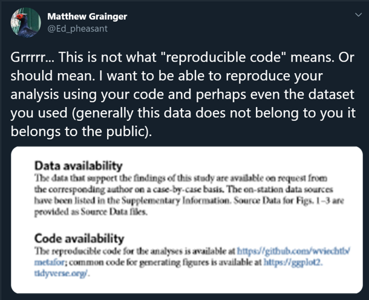
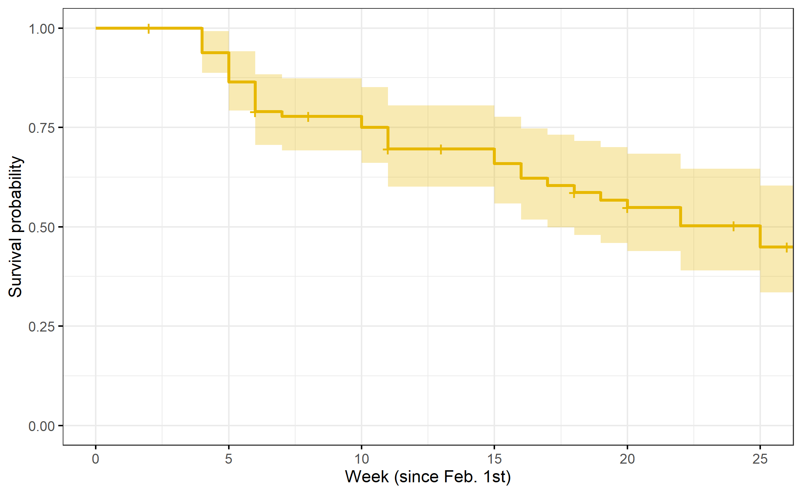

<!-- Limit image width and height -->
<style type='text/css'>
img {
    max-height: 560px;
    max-width: 964px;
}
</style>

<!-- Center image on slide -->
<script src="http://ajax.aspnetcdn.com/ajax/jQuery/jquery-1.7.min.js"></script>
<script type='text/javascript'>
$(function() {
    $("p:has(img)").addClass('centered');
});
</script>

## Schematic of current workflow
 


--- .class #id 

## Data sharing 


--- .class #id 

## Code sharing 

 


--- .class #id 

## We are sharing data - but not code

Culina et al. (2020) PLoS Biol 18(7): e3000763. (n=346)


 

--- .class #id 

## Although data sharing may not be complete 
"56% were incomplete" (n= 100)


--- .class #id

## And reuse is prevented
"64% were archived in a way that prevented reuse" (n= 100)


--- .class #id

##  Barriers to data sharing
Wiley survey 2014 (n=2250)

<style type="text/css"> body {background:none transparent; } </style>


<iframe src="C:/Users/matthew.grainger/Documents/Projects_in_development/LNC2020_presentation/slides/assets/widgets/wiley.html" width=100% height=100% allowtransparency="true"> </iframe>

--- .class #id

## Schematic of future workflow


--- .class #id 

## Introducing LivingNorwayR

https://github.com/LivingNorway/LivingNorwayR

- An R package designed to facilitate the future workflow
- Main features 
  - Import & Export Darwin Core Archive
  - Mapping data (with reduced pain) to DWC terms
  - Metadata extraction functions
  - Plotting functions
  - Modelling functions 

--- .class #id

## Toolchain walkthrough

We will import this data and use it to demonstrate some of the workflow

Nilsen E B, Pedersen H C, Brøseth H, Moa P F, Vang R (2019). Rock ptarmigan (Lagopus muta) radio telemetry in Lierne, Norway. Version 1.2. Norwegian Institute for Nature Research. Occurrence dataset https://doi.org/10.15468/o4zcd3 accessed via GBIF.org on 2020-10-10.
https://www.gbif.org/dataset/b848f1f3-3955-4725-8ad8-e711e4a9e0ac#


--- .class #id

## Set up the "Living Norway data package" structure


```r
library(LivingNorwayR)
build_folder_structure(project_name = "Tetraonidae_Lagopus")
map_folders(project_name = "Tetraonidae_Lagopus")
#map_files(project_name = "Tetraonidae_Lagopus")
```


<iframe src="./assets/widgets/plot.html" width=100% height=100% allowtransparency="true"> </iframe>

--- .class #id

## Import the data and map to DwCObject 


```r
Rock<-DwCOccurence$new(
  id<-occurrence$id,
  ownerInstitutionCode<-occurrence$ownerInstitutionCode,
  basisOfRecord<-occurrence$basisOfRecord,
  dynamicProperties<-occurrence$dynamicProperties,
  occurrenceID<-occurrence$occurrenceID,
  sex<-occurrence$sex,
  lifeStage<-occurrence$lifeStage,
  organismID<-occurrence$organismID,
  organismName<-occurrence$organismName,
  eventDate<-occurrence$eventDate,
  ...)
```

--- .class #id

## Helper functions


```r
DwCClassList$`dwc:Occurrence`$termInfo
```

dwc:Occurrence - Occurrence
An existence of an Organism (sensu http://rs.tdwg.org/dwc/terms/Organism) at a particular place at a particular time.

	Defined in: https://dwc.tdwg.org/
	IRI: http://rs.tdwg.org/dwc/terms/Occurrence
	Version IRI: http://rs.tdwg.org/dwc/terms/version/Occurrence-2020-08-20
	Type: Class
	Date modified: 2020-08-20
	Executive committee decisions:
		http://rs.tdwg.org/decisions/decision-2014-10-26_15
	Examples:
		A wolf pack on the shore of Kluane Lake in 1988. A virus in a plant leaf in the New York Botanical Garden at 15:29 on 2014-10-23. A fungus in Central Park in the summer of 1929.

--- .class #id


## Make use of the data 


```r
df<-Rock$object()
summary(df$sex)
```

```
##   F   M 
## 180 198
```

```r
summary(df$lifeStage)
```

```
##    adult juvenile 
##      211      167
```

```r
bb<-Rock$get_bounding_box()
```

```
##     minX     maxX     minY     maxY 
## 12.65946 14.65305 64.03308 64.77377
```

--- .class #id

## Produce maps 


```r
Map<-Rock$plotmap()
Map
```


--- .class #id

## Explore the metadata

>Early stage of development


```r
RockXML<-("C:/Users/matthew.grainger/Documents/Projects_in_development/LNC2020_presentation/slides/Tetraonidae_Lagopus/metadata/eml.xml")

metadata<-DwCMetaData$new(RockXML)
metadata$get_eml()
```

```
## <?xml version="1.0"?>
## <eml:eml xmlns:eml="eml://ecoinformatics.org/eml-2.1.1" xmlns:dc="http://purl.org/dc/terms/" xmlns:xsi="http://www.w3.org/2001/XMLSchema-instance" xsi:schemaLocation="eml://ecoinformatics.org/eml-2.1.1 http://rs.gbif.org/schema/eml-gbif-profile/1.1/eml.xsd" packageId="b848f1f3-3955-4725-8ad8-e711e4a9e0ac/v1.2" system="http://gbif.org" scope="system" xml:lang="eng">
##   <dataset>
##     <alternateIdentifier>b848f1f3-3955-4725-8ad8-e711e4a9e0ac</alternateIdentifier>
##     <alternateIdentifier>http://data.nina.no:8080/ipt/resource?r=rockptarmigan_radiotelemetry_liernenorway</alternateIdentifier>
##     <title xml:lang="eng">Rock ptarmigan (Lagopus muta) radio telemetry in Lierne, Norway</title>
##     <creator>
##       <individualName>
##         <givenName>Erlend B.</givenName>
##         <surName>Nilsen</surName>
##       </individualName>
##       <organizationName>Norwgian Institute for Nature Researech (NINA)</organizationName>
##       <positionName>Senior Research Scientist</positionName>
##       <address>
##         <deliveryPoint>Norwegian Institute for Nature Research</deliveryPoint>
##         <city>Trondheim</city>
##         <postalCode>7485</postalCode>
##         <country>NO</country>
##       </address>
##       <electronicMailAddress>erlend.nilsen@nina.no</electronicMailAddress>
##     </creator>
##     <creator>
##       <individualName>
##         <givenName>Hans Chr.</givenName>
##         <surName>Pedersen</surName>
##       </individualName>
##       <organizationName>Norwgian Institute for Nature Researech (NINA)</organizationName>
##       <positionName>Senior Research Scientist</positionName>
##       <address>
##         <deliveryPoint>Norwegian Institute for Nature Research</deliveryPoint>
##         <city>Trondheim</city>
##         <postalCode>7485</postalCode>
##         <country>NO</country>
##       </address>
##       <electronicMailAddress>hans.pedersen@nina.no</electronicMailAddress>
##     </creator>
##     <creator>
##       <individualName>
##         <givenName>Henrik</givenName>
##         <surName>Br&#xF8;seth</surName>
##       </individualName>
##       <organizationName>Norwegian Institute for Nature Research (NINA)</organizationName>
##       <positionName>Senior Research Scientist</positionName>
##       <address>
##         <deliveryPoint>Norwegian Institute for Nature Research</deliveryPoint>
##         <city>Trondheim</city>
##         <postalCode>7485</postalCode>
##         <country>NO</country>
##       </address>
##       <electronicMailAddress>henrik.broseth@nina.no</electronicMailAddress>
##     </creator>
##     <creator>
##       <individualName>
##         <givenName>P&#xE5;l F.</givenName>
##         <surName>Moa</surName>
##       </individualName>
##       <organizationName>Nord University</organizationName>
##       <positionName>Senior Lecturer</positionName>
##       <address>
##         <country>NO</country>
##       </address>
##       <electronicMailAddress>paal.f.moa@nord.no</electronicMailAddress>
##     </creator>
##     <metadataProvider>
##       <individualName>
##         <givenName>Erlend B.</givenName>
##         <surName>Nilsen</surName>
##       </individualName>
##       <organizationName>Norwegian Institute for Nature Research (NINA)</organizationName>
##       <positionName>Senior Research Scientist</positionName>
##       <address>
##         <deliveryPoint>Norwegian Institute for Nature Research</deliveryPoint>
##         <city>Trondheim</city>
##         <postalCode>7485</postalCode>
##         <country>NO</country>
##       </address>
##       <electronicMailAddress>erlend.nilsen@nina.no</electronicMailAddress>
##       <userId directory="http://orcid.org/">0000-0002-5119-8331</userId>
##     </metadataProvider>
##     <metadataProvider>
##       <individualName>
##         <givenName>Roald</givenName>
##         <surName>Vang</surName>
##       </individualName>
##       <organizationName>Norwegian Institute for Nature Research (NINA)</organizationName>
##       <address>
##         <deliveryPoint>Norwegian Institute for Nature Research</deliveryPoint>
##         <city>Trondheim</city>
##         <postalCode>7485</postalCode>
##         <country>NO</country>
##       </address>
##       <electronicMailAddress>rv@nina.no</electronicMailAddress>
##     </metadataProvider>
##     <pubDate>
##       2019-09-17
##   </pubDate>
##     <language>eng</language>
##     <abstract>
##       <para>This data set is based on a small radio telemetry project on rock ptarmigan (Lagopus muta) in Lierne municipality, central Norway. In total, 85 rock ptarmigans were captured and radio-collared. After release, the birds were re-located with variable geographical precision (noted in the data). When mortality were detected, cause of death was as far as possible recorded. 
## 
## In the published data, cause of death is attributed to one of two causes (hunting OR other causes), and this information is available in the field "dynamicProperties" together with information about the event (capture OR radiotelemetry/recature). In some cases more detailed information about the event and state is available in the raw data.</para>
##     </abstract>
##     <keywordSet>
##       <keyword>Occurrence</keyword>
##       <keywordThesaurus>GBIF Dataset Type Vocabulary: http://rs.gbif.org/vocabulary/gbif/dataset_type.xml</keywordThesaurus>
##     </keywordSet>
##     <keywordSet>
##       <keyword>Observation</keyword>
##       <keywordThesaurus>GBIF Dataset Subtype Vocabulary: http://rs.gbif.org/vocabulary/gbif/dataset_subtype.xml</keywordThesaurus>
##     </keywordSet>
##     <intellectualRights>
##       <para>This work is licensed under a <ulink url="http://creativecommons.org/licenses/by/4.0/legalcode"><citetitle>Creative Commons Attribution (CC-BY) 4.0 License</citetitle></ulink>.</para>
##     </intellectualRights>
##     <coverage>
##       <geographicCoverage>
##         <geographicDescription>Study area mainly in central Norway (Lierne and Sn&#xE5;sa municipalities). Some re-locations of radio-collared ptarmigans in Sweden are included in the data set.</geographicDescription>
##         <boundingCoordinates>
##           <westBoundingCoordinate>12.659</westBoundingCoordinate>
##           <eastBoundingCoordinate>14.653</eastBoundingCoordinate>
##           <northBoundingCoordinate>64.774</northBoundingCoordinate>
##           <southBoundingCoordinate>64.033</southBoundingCoordinate>
##         </boundingCoordinates>
##       </geographicCoverage>
##       <temporalCoverage>
##         <rangeOfDates>
##           <beginDate>
##             <calendarDate>2012-02-14</calendarDate>
##           </beginDate>
##           <endDate>
##             <calendarDate>2014-09-17</calendarDate>
##           </endDate>
##         </rangeOfDates>
##       </temporalCoverage>
##       <taxonomicCoverage>
##         <taxonomicClassification>
##           <taxonRankName>species</taxonRankName>
##           <taxonRankValue>Lagopus muta</taxonRankValue>
##           <commonName>Rock ptarmigan</commonName>
##         </taxonomicClassification>
##       </taxonomicCoverage>
##     </coverage>
##     <maintenance>
##       <description>
##         <para/>
##       </description>
##       <maintenanceUpdateFrequency>asNeeded</maintenanceUpdateFrequency>
##     </maintenance>
##     <contact>
##       <individualName>
##         <givenName>Erlend B.</givenName>
##         <surName>Nilsen</surName>
##       </individualName>
##       <organizationName>Norwegian Institute for Nature Research (NINA)</organizationName>
##       <positionName>Senior Research Scientist</positionName>
##       <address>
##         <deliveryPoint>Norwegian Institute for Nature Research</deliveryPoint>
##         <city>Trondheim</city>
##         <postalCode>7485</postalCode>
##         <country>NO</country>
##       </address>
##       <electronicMailAddress>erlend.nilsen@nina.no</electronicMailAddress>
##       <userId directory="http://orcid.org/">0000-0002-5119-8331</userId>
##     </contact>
##     <contact>
##       <individualName>
##         <givenName>Roald</givenName>
##         <surName>Vang</surName>
##       </individualName>
##       <organizationName>Norwegian Institute for Nature Research (NINA)</organizationName>
##       <address>
##         <deliveryPoint>Norwegian Institute for Nature Research</deliveryPoint>
##         <city>Trondheim</city>
##         <postalCode>7485</postalCode>
##         <country>NO</country>
##       </address>
##       <electronicMailAddress>rv@nina.no</electronicMailAddress>
##     </contact>
##     <project>
##       <title>Rock ptarmigan (Lagopus muta) telemetry project in Lierne, Norway 2012-2014</title>
##       <personnel>
##         <individualName>
##           <givenName>Erlend B.</givenName>
##           <surName>Nilsen</surName>
##         </individualName>
##         <role>principalInvestigator</role>
##       </personnel>
##       <personnel>
##         <individualName>
##           <givenName>Henrik</givenName>
##           <surName>Br&#xF8;seth</surName>
##         </individualName>
##         <role>principalInvestigator</role>
##       </personnel>
##       <personnel>
##         <individualName>
##           <givenName>Hans Chr.</givenName>
##           <surName>Pedersen</surName>
##         </individualName>
##         <role>principalInvestigator</role>
##       </personnel>
##       <personnel>
##         <individualName>
##           <givenName>P&#xE5;l F.</givenName>
##           <surName>Moa</surName>
##         </individualName>
##         <role>principalInvestigator</role>
##       </personnel>
##       <abstract>
##         <para>The purpose of the study was both to provide basic ecological knowledge about rock ptarmigan in Norway, and to assess the applicability and usefulness of a suite of field methods to study rock ptarmigan biology, demography and population dynamics. In addition to the radio-telemetry, pilot studies focusing on point-count studies and site-occupancy dynamics, as well as mark-recapture studies based on fecal DNA was preformed.</para>
##       </abstract>
##       <funding>
##         <para>The project was funded by a grant from the Norwegian Environment Agency (grant #12040045; Rock ptarmigan demography and population status). All handling of animals were in agreement with Norwegian laws, and approved by the Norwegian Food Safety Authority (approval ID 3960).</para>
##       </funding>
##       <studyAreaDescription>
##         <descriptor name="generic" citableClassificationSystem="false">
##           <descriptorValue>The main study area was in Lierne municipality, Nord-Tr&#xF8;ndelag county, Norway. All capture of rock ptarmigan for the radio-telemetry study was conducted around Lierne National Park. Point-count studies and mark-recapture studies based on fecal DNA was performed at Lifjellet, Lierne, Norway.</descriptorValue>
##         </descriptor>
##       </studyAreaDescription>
##     </project>
##   </dataset>
##   <additionalMetadata>
##     <metadata>
##       <gbif>
##         <dateStamp>2017-04-10T01:29:21.482+02:00</dateStamp>
##         <hierarchyLevel>dataset</hierarchyLevel>
##         <citation>Nilsen E B, Pedersen H C, Br&#xF8;seth H, Moa P F (2017): Rock ptarmigan (Lagopus muta) radio telemetry in Lierne, Norway. v1.2. Norwegian Institute for Nature Research. Dataset/Occurrence. http://data.nina.no:8080/ipt/resource?r=rockptarmigan_radiotelemetry_liernenorway&amp;v=1.2</citation>
##         <bibliography>
##           <citation identifier="http://hdl.handle.net/11250/2379287">Nilsen, E.B., Pedersen, H.C., Br&#xF8;seth, H., Kleven, O., Moa, P.F. &amp; Hagen, B.R. 2015. Fjellrypeprosjektet i Lierne: &#xC5;rsrapport 2015. NINA Rapport 1217. 28 s.</citation>
##         </bibliography>
##         <dc:replaces>b848f1f3-3955-4725-8ad8-e711e4a9e0ac/v1.2.xml</dc:replaces>
##       </gbif>
##     </metadata>
##   </additionalMetadata>
## </eml:eml>
## 
```

--- .class #id

## Do some analysis


```
## Call: survfit(formula = Surv(entry, exit, event) ~ 1, data = CH)
## 
##  time n.risk n.event censored survival std.err lower 95% CI upper 95% CI
##     4     81       5        1    0.938  0.0267        0.887        0.992
##     5     76       6        0    0.864  0.0381        0.793        0.942
##     6     70       6        1    0.790  0.0452        0.706        0.884
##     7     63       1        0    0.778  0.0462        0.692        0.874
##    10     57       2        9    0.750  0.0485        0.661        0.852
##    11     55       4        6    0.696  0.0521        0.601        0.806
##    15     38       2        7    0.659  0.0554        0.559        0.777
##    16     36       2        0    0.622  0.0580        0.519        0.747
##    17     34       1        0    0.604  0.0592        0.499        0.732
##    18     33       1        1    0.586  0.0601        0.479        0.716
##    19     31       1        0    0.567  0.0611        0.459        0.700
##    20     30       1        5    0.548  0.0619        0.439        0.684
##    22     24       2        0    0.502  0.0646        0.390        0.646
##    25     19       2        3    0.450  0.0678        0.335        0.604
```

```
## Call: survfit(formula = Surv(entry, exit2, event2) ~ 1, data = CH_h)
## 
##  time n.risk n.event censored survival std.err lower 95% CI upper 95% CI
##     4     81       7       75    0.914  0.0312        0.854        0.977
```

```
## Call: survfit(formula = Surv(entry, exit2, event2) ~ 1, data = CH_e)
## 
##  time n.risk n.event censored survival std.err lower 95% CI upper 95% CI
##     4     81       5        1    0.938  0.0267        0.887        0.992
##     5     76       6        0    0.864  0.0381        0.793        0.942
##     6     70       6        1    0.790  0.0452        0.706        0.884
##     7     63       1        0    0.778  0.0462        0.692        0.874
##    10     57       2        9    0.750  0.0485        0.661        0.852
##    11     55       4        6    0.696  0.0521        0.601        0.806
```

```
## Call: survfit(formula = Surv(entry2, exit, event) ~ 1, data = CH_l)
## 
##  time n.risk n.event censored survival std.err lower 95% CI upper 95% CI
##    15     38       2        0    0.947  0.0362        0.879        1.000
##    16     36       2        0    0.895  0.0498        0.802        0.998
##    17     34       1        0    0.868  0.0548        0.767        0.983
##    18     33       1        1    0.842  0.0592        0.734        0.966
##    19     31       1        0    0.815  0.0632        0.700        0.949
##    20     30       1        5    0.788  0.0667        0.667        0.930
##    22     24       2        0    0.722  0.0756        0.588        0.886
##    25     19       2        3    0.646  0.0846        0.500        0.835
```

--- .class #id


## Make a plot




--- .class #id

## Write it up

### Results

Out of 84 radio marked rock ptarmigans, 33 were shot by hunters in the study area, and 9 were recorded as dead due to other causes (mostly predation). 

### Results (under the covers)

Out of ``r length(unique(d$organismName))`` radio marked rock ptarmigans, ``r  Deaths[1,2]`` were shot by hunters in the study area, and ``r Deaths[2,2]`` were recorded as dead due to other causes (mostly predation). 

--- .class #id

## Conclusions

- LivingNorwayR is still in development
  - Please let us know what functionality you need
    - Github issues: https://github.com/LivingNorway/LivingNorwayR/issues
    - Slack: Joseph Chipperfield, Matt Grainger, Erlend Nilsen
    - Email: matthew.grainger@nina.no
    


--- .class id#


