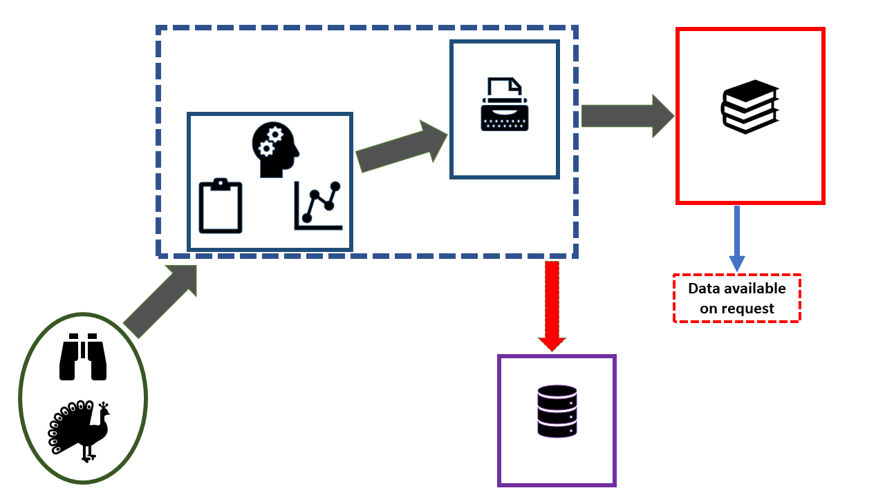
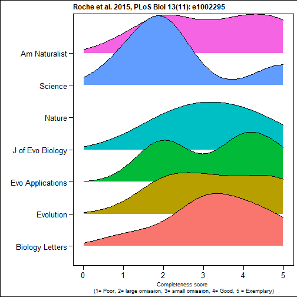
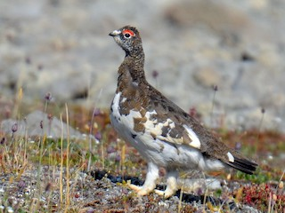

<!-- Limit image width and height -->
<style type='text/css'>
img {
    max-height: 560px;
    max-width: 964px;
}
</style>

<!-- Center image on slide -->
<script src="http://ajax.aspnetcdn.com/ajax/jQuery/jquery-1.7.min.js"></script>
<script type='text/javascript'>
$(function() {
    $("p:has(img)").addClass('centered');
});
</script>

## Schematic of current workflow
 



--- .class #id 

## Data sharing 


--- .class #id 

## Code sharing 

 


--- .class #id 

## We are sharing data - but not code

Culina et al. (2020) PLoS Biol 18(7): e3000763. (n=346)


 

--- .class #id 

## Although data sharing may not be complete 
"56% were incomplete" (n= 100)




--- .class #id

## And reuse is prevented
"64% were archived in a way that prevented reuse" (n= 100)


--- .class #id

##  Barriers to data sharing
Wiley survey 2014 (n=2250)

<style type="text/css"> body {background:none transparent; } </style>


<iframe src="C:/Users/matthew.grainger/Documents/Projects_in_development/LNC2020_presentation/slides/assets/widgets/wiley.html" width=100% height=100% allowtransparency="true"> </iframe>

--- .class #id

## Schematic of future workflow


--- .class #id 

## Introducing LivingNorwayR

https://github.com/LivingNorway/LivingNorwayR

- An R package designed to facilitate the future workflow
- Main features 
  - Import & Export Darwin Core Archive
  - Mapping data (with reduced pain) to DWC terms
  - Metadata extraction functions
  - Plotting functions
  - Modelling functions 

--- .class #id

## Toolchain walkthrough

### Go out and get some data




--- .class #id

### Set up the "Living Norway data package" structure


```r
build_folder_structure(project_name = "Tetraonidae_Lagopus")
```


<iframe src="./assets/widgets/plot.html" width=100% height=100% allowtransparency="true"> </iframe>

--- .class #id

### "Map" your raw data to Darwin Core Terms (use the functions provided to get the metadata) and produce a DwC-a


```r
out<-LivingNorwayR::get_geographic_extent(d, lon = "decimalLongitude", lat= "decimalLatitude", 
                                     add_map = "yes")
out[[1]]
```

```
##     xmin     ymin     xmax     ymax 
## 12.65946 64.03308 14.65305 64.77377
```

--- .class #id

### Use your DWCa to perform and write-up your analysis

#### Make a map


<iframe src="./assets/widgets/map.html" width=100% height=100% allowtransparency="true"> </iframe>


--- .class #id

#### Run an analysis


```
## Call: survfit(formula = Surv(entry, exit, event) ~ 1, data = CH)
## 
##  time n.risk n.event censored survival std.err lower 95% CI upper 95% CI
##     4     81       5        1    0.938  0.0267        0.887        0.992
##     5     76       6        0    0.864  0.0381        0.793        0.942
##     6     70       6        1    0.790  0.0452        0.706        0.884
##     7     63       1        0    0.778  0.0462        0.692        0.874
##    10     57       2        9    0.750  0.0485        0.661        0.852
##    11     55       4        6    0.696  0.0521        0.601        0.806
##    15     38       2        7    0.659  0.0554        0.559        0.777
##    16     36       2        0    0.622  0.0580        0.519        0.747
##    17     34       1        0    0.604  0.0592        0.499        0.732
##    18     33       1        1    0.586  0.0601        0.479        0.716
##    19     31       1        0    0.567  0.0611        0.459        0.700
##    20     30       1        5    0.548  0.0619        0.439        0.684
##    22     24       2        0    0.502  0.0646        0.390        0.646
##    25     19       2        3    0.450  0.0678        0.335        0.604
```

```
## Call: survfit(formula = Surv(entry, exit2, event2) ~ 1, data = CH_h)
## 
##  time n.risk n.event censored survival std.err lower 95% CI upper 95% CI
##     4     81       7       75    0.914  0.0312        0.854        0.977
```

```
## Call: survfit(formula = Surv(entry, exit2, event2) ~ 1, data = CH_e)
## 
##  time n.risk n.event censored survival std.err lower 95% CI upper 95% CI
##     4     81       5        1    0.938  0.0267        0.887        0.992
##     5     76       6        0    0.864  0.0381        0.793        0.942
##     6     70       6        1    0.790  0.0452        0.706        0.884
##     7     63       1        0    0.778  0.0462        0.692        0.874
##    10     57       2        9    0.750  0.0485        0.661        0.852
##    11     55       4        6    0.696  0.0521        0.601        0.806
```

```
## Call: survfit(formula = Surv(entry2, exit, event) ~ 1, data = CH_l)
## 
##  time n.risk n.event censored survival std.err lower 95% CI upper 95% CI
##    15     38       2        0    0.947  0.0362        0.879        1.000
##    16     36       2        0    0.895  0.0498        0.802        0.998
##    17     34       1        0    0.868  0.0548        0.767        0.983
##    18     33       1        1    0.842  0.0592        0.734        0.966
##    19     31       1        0    0.815  0.0632        0.700        0.949
##    20     30       1        5    0.788  0.0667        0.667        0.930
##    22     24       2        0    0.722  0.0756        0.588        0.886
##    25     19       2        3    0.646  0.0846        0.500        0.835
```

--- .class #id


#### Make a plot


--- .class #id

### Write it up

##### Results

Out of 84 radio marked rock ptarmigans, 33 were shot by hunters in the study area, and 9 were recorded as dead due to other causes (mostly predation). 

##### Results (under the covers)

Out of ``r length(unique(d$organismName))`` radio marked rock ptarmigans, ``r  Deaths[1,2]`` were shot by hunters in the study area, and ``r Deaths[2,2]`` were recorded as dead due to other causes (mostly predation). 

--- .class #id

## Conclusions

- LivingNorwayR is still in development
  - Please let us know what functionality you need
    - Github issues: https://github.com/LivingNorway/LivingNorwayR/issues
    - Slack: Joseph Chipperfield, Matt Grainger, Erlend Nilsen
    - Email: matthew.grainger@nina.no
    


--- .class id#


